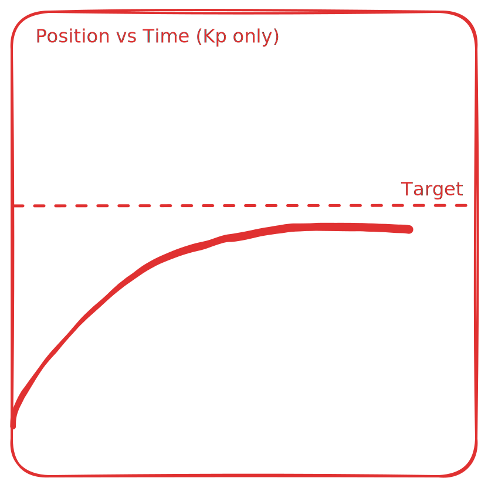
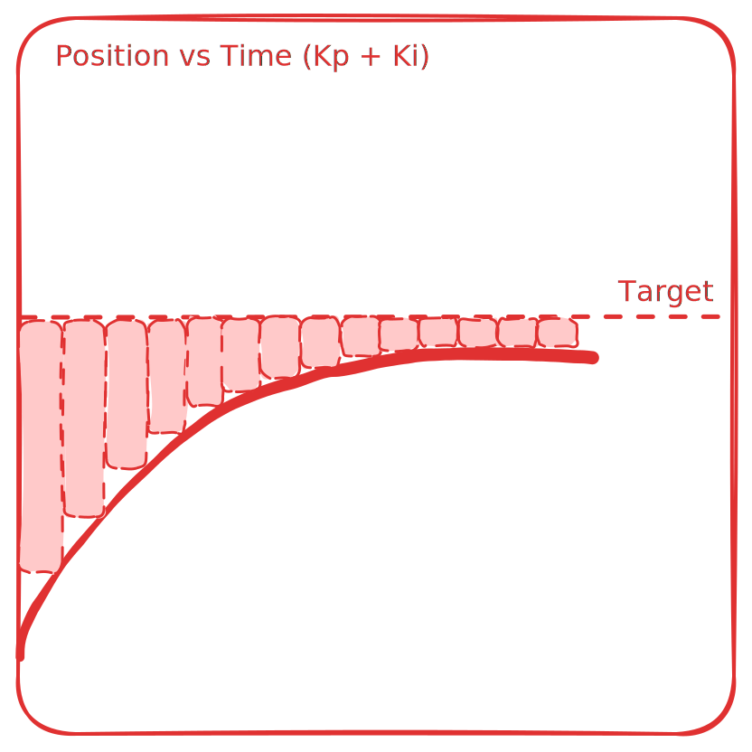

# PID

$$u(t)=K_{\text{p}}e(t)+K_{\text{i}}\int _{0}^{t}e(\tau )\,\mathrm {d} \tau +K_{\text{d}}{\frac {\mathrm {d} e(t)}{\mathrm {d} t}}$$

PID consists of 3 terms: Kp, Ki, and Kd.

PID depends on knowing what your position is compared to where you want to be. This is known as the error and denoted as $e(t)$.

{ width="250" align=right }

$$e(t) = target - current$$

The first segment of the PID is $K_pe(t)$. In this case, a constant "Kp" is multiplied by the error at a certain time. 

This makes it so that as the error decreases, (ie. you get closer to the target) the power output is lowered. This results in a graph that looks like the image shown

Although this gives us the intended effect of slowing down as we get closer to the target, we don't quite get to the target. We have two options in this case: 1. Focus on refining the Kp value, and 2. Include a Ki value.

!!! note
    Havings a Kp value that is too high causes oscilations. This occurs when the power output is too high to slow down in time and the program overshoots the target.

{ width="250" align=left }

By adding a Ki term to the pid, we can add a term that sums a fraction of the area to the output. This means that if we have a situation like seen above, as time increases, the output would increase too. This overcomes the voltage needed to overcome static friction.

!!! warning
    Having a Ki value can be disasterous if an obstruction occurs on the motor. This means that the output gets absurdly high when something is blocking the motor.

The Kd term can help if you are going too fast to stop, but in general you should be able to get by with just the Kp term.
